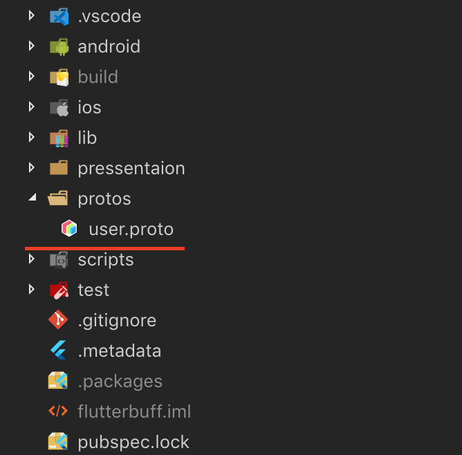

# Flutterbuff

Is an Example Project about how to setup Protobuf over MethodChannels. So,
instead of using Maps of String to Any/Object.

# Proto files
First we need a common folder outside of lib to store our proto files. In this example we will keep the in `./proto`


Next, let's add out user definition to the `user.proto`
```protobuf
syntax = "proto3";

option java_package = "com.mtilbrook.app";

message User {
  string uid = 1;
  string providerId = 2;
  string displayName = 3;
  string email = 4;
  bool isEmailVerified = 5;
}

```

Next we need to install all the protobuf toolchains

# Install Protobuff
## Protoc
```sh
brew install protobuf
```

## Swift
```sh
brew install swift-protobuf
```

## ObjC
```sh
TODO PRs welcome.
```

## Dart
```sh
flutter pub global activate protoc_plugin
```

## Android
### Protobuf Plugin
First we need to add the protobuf plugin.

```groovy
buildscript {
  repositories {
    mavenCentral()
  }
  dependencies {
    classpath 'com.google.protobuf:protobuf-gradle-plugin:0.8.10'
  }
}
```

**NOTE**: `protobuf-gradle-plugin:0.8.10` or above requires Java 8. So, need to set source and target Compatibility to `VERSION_1_8` in the `build.gradle` files.

```groovy
android {
  compileOptions {
    sourceCompatibility JavaVersion.VERSION_1_8
    targetCompatibility JavaVersion.VERSION_1_8
  }
}
```

### Module config
We need to tell the plugin where out protofiles are. In this example they are in the flutter project root.

```groovy
android {
    sourceSets {
        String rootPath = rootProject
          .rootDir
          .parentFile
          .path
        main.proto.srcDirs += "$rootPath/protos"
    }
```

# Compiling

## Android
Android we need to configure the protobuf plugin for the modules we use protobuf.
```groovy
dependencies {
    // You need to depend on the lite runtime library,
    // not protobuf-java
    implementation 'com.google.protobuf:protobuf-javalite:3.8.0'
}

protobuf {
    protoc {
        artifact = 'com.google.protobuf:protoc:3.8.0'
    }
    generateProtoTasks {
        all().each { task ->
            task.builtins {
                java {
                    option "lite"
                }
            }
        }
    }
}
```

## Dart & iOS

**NOTE**: ObjC example is not done yet. PRs welcome.

Dart and Swift we can just make shell script and use the
protoc bin to generate the files.
```sh
# Swift
find ./protos -type f -name '**.proto' | tee /dev/tty | \
  xargs protoc --swift_out=./ios/Classes

# Dart
find ./protos -type f -name '**.proto' | tee /dev/tty | \
  xargs protoc --dart_out=./lib/gen
```

See the [gen_proto.sh](./scripts/gen_proto.sh) for a more fleshed out generation script. In short we pass the proto files to protoc with a flag for the target language.


# Passing proto via MethodChannel

Let's create a User in Android and pass it to Flutter.
```kotlin
val user =
  UserOuterClass
    .User
    .newBuilder()
    .apply {
      uid = "some-uid"
      providerId = "providerId"
      displayName = "Mitchell"
      email = "Mitchell at example.com"
      isEmailVerified = false
    }
    .build()

// Now we need to serialize
val bytes = user.toByteArray()
appMethodChannel.invokeMethod("authResult", bytes)
```

To read the user back in Dart we use the `User.fromBuffer` to parse the
byteArray back into a user.
```dart
Future<dynamic> _authHandler(MethodCall call) {
    switch (call.method) {
      case "authResult":
        User user = User.fromBuffer(call.arguments);
        break;
    }
    return Future.value(null);
  }
```
